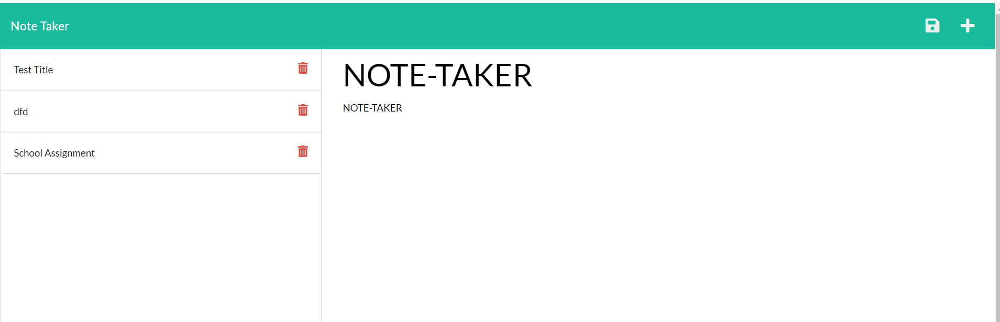

# NOTE TAKER
 
  
 
  ## Description 
  I made an application that allows you to insert a note.  Then the note is saved and you can extract it for later use.
  ## Table of Contents
  * [Installation](#installation)
  * [Usage](#usage)
  * [License](#license)
  * [Contributing](#contributing)
  * [Tests](#tests)
  * [Questions](#questions)
  
  ## Installation 
  First, install node with npm i. Then install express.js with npm i express
  ## Usage 
  Run npm start on the command line.  Then enter the page that is created with the server inside the browser! Enter the page using localhost:3001 on your browser!
  ## License 
  This project is licensed under no one it is a school assignment.
  ## Contributing 
  None it is a school assignment.
  ## Tests
  npm start
  ## Questions
  If you have any questions about this projects, please contact me directly at samschool789@gmail.com. You can view more of my projects at https://github.com/samschool789.
